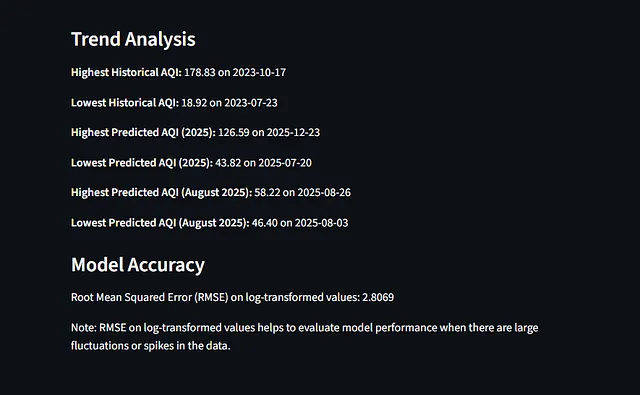
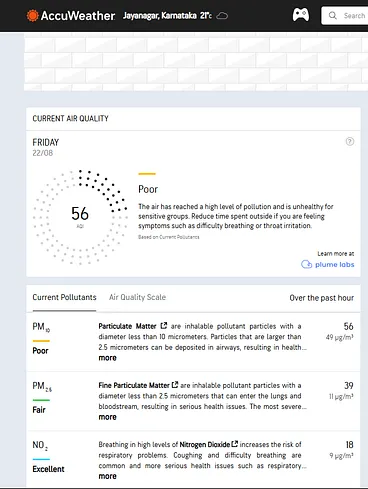
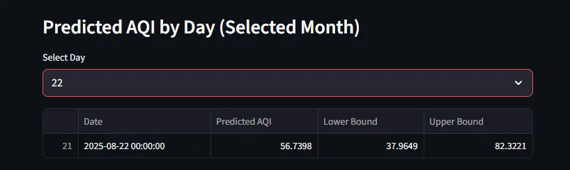
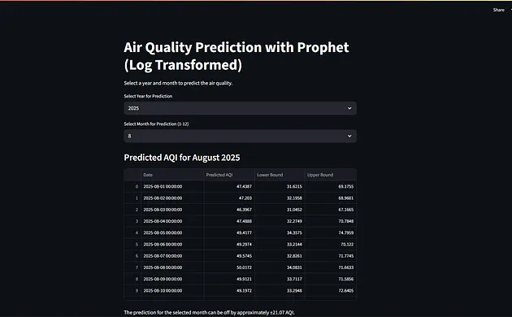
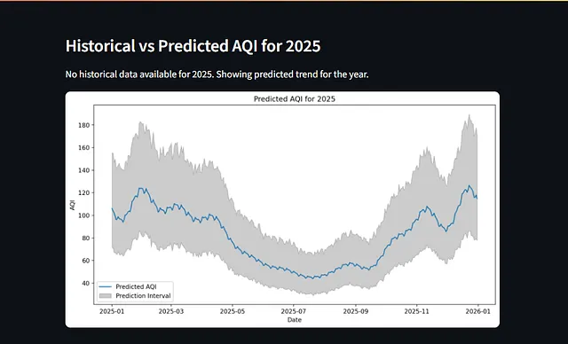
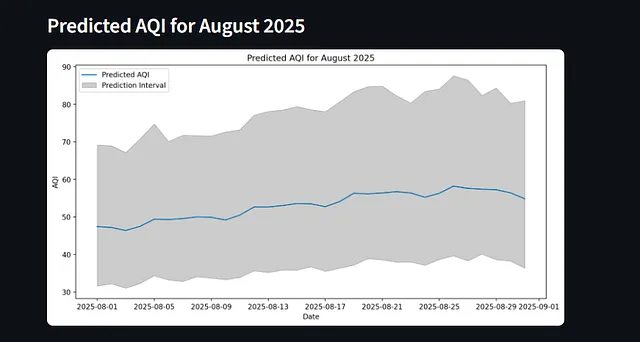
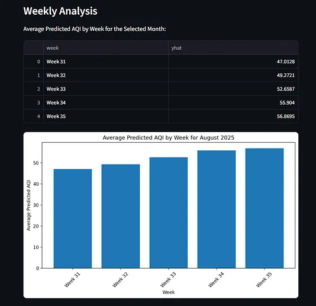
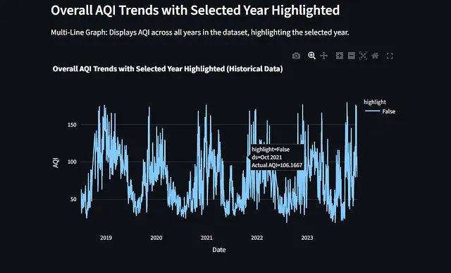
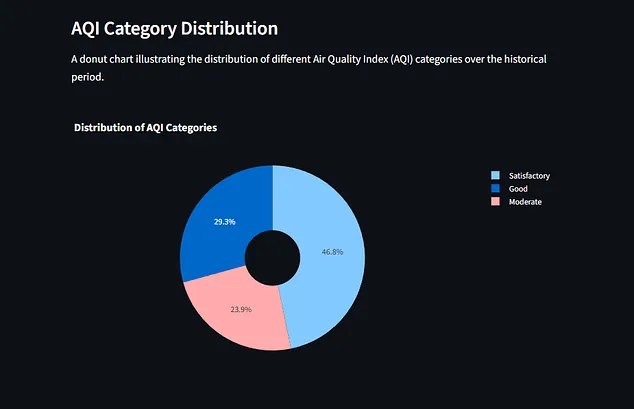
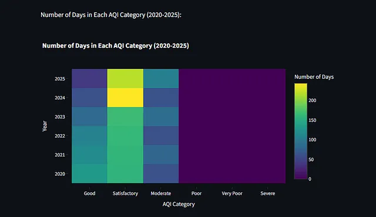

# 🌫️ AirQualityPrediction

[Live Demo (Streamlit)](https://airqualityprediction-dsrrqwazf2hrwqg8g6bvme.streamlit.app/) • [Source (GitHub)](https://github.com/AdityaRKori/AirQualityPrediction)

**Forecasting daily Air Quality Index (AQI) for Jayanagar (Bengaluru) using Prophet — trained on 2018–2023 open data.**

---

## TL;DR
- **Model:** Prophet (additive — trend + seasonality)  
- **Data:** hourly AQI readings from **2018–2023** for Jayanagar. Source: :contentReference[oaicite:0]{index=0} (Jayanagar station).  
- **Output:** daily-average AQI forecast (median + uncertainty intervals). Supports forecasting up to ~6 years (practical limit given training data).  
- **Use-cases:** neighborhood planning, citizen awareness, exploratory policy insights (NOT a clinical advisory).

---

## Quick links
- Live demo: https://airqualityprediction-dsrrqwazf2hrwqg8g6bvme.streamlit.app/  
- Repo: https://github.com/AdityaRKori/AirQualityPrediction  
- Location modeled: :contentReference[oaicite:1]{index=1} in :contentReference[oaicite:2]{index=2}.

---

## Problem statement
Urban air quality varies by micro-location and time. Citizens and local decision-makers need forward-looking, interpretable signals to:
- prepare for hazardous days,
- schedule outdoor events or school activities,
- prioritize ward-level mitigation.

This project asks: **Can we build a reproducible, interpretable AQI forecast for one neighborhood using public sensors and a simple time-series model?**

---

## Data & ethical note
- **Source:** BBMP Open Data (public). :contentReference[oaicite:3]{index=3}.  
- **Station / scope:** Jayanagar only. :contentReference[oaicite:4]{index=4}.  
- **Time span:** hourly records, 2018–2023 → aggregated to **daily averages** for modeling.  
- **Ethics:** Open data ensures reproducibility; forecasts are **informational** only. Always consult official advisories for health-critical decisions.

---

## In-App Display — Visual walkthrough

> Files are referenced by their repo-root filenames (exact names you uploaded). If a preview breaks on GitHub, rename the image file to a short hyphenated name and update the corresponding `src`.

---

### 1) Trend Analysis & Model Accuracy


**Meaning:** highest/lowest historical AQI, peak predicted AQI dates, and a reported RMSE on log-transformed values. Use this figure as a quick model-health check and to highlight notable extreme dates in the dataset.

---

### 2) Live External AQI Snapshot (Reference)


**Meaning:** a sample third-party snapshot (e.g., AccuWeather / Plume) used to cross-check short-term readings against model output. Helps illustrate short-term alignment / deviation from live feeds.

---

### 3) Predicted AQI by Day (Selected Month — Table)


**Meaning:** day-level forecast for the selected month showing median prediction and lower/upper bounds. Useful for day-to-day planning (schools, events).

---

### 4) Forecast Controls & Monthly Output Table (UI)


**Meaning:** Streamlit UI controls where user selects year/month. The panel displays the monthly table output and download option for CSV.

---

### 5) Historical vs Predicted AQI (Annual View)


**Meaning:** Year-level predicted series with shaded uncertainty. Good for conveying seasonal cycles and the widening uncertainty over long horizons.

---

### 6) Predicted AQI for a Month (Plot)


**Meaning:** focused daily forecast plot for a specific month (example: Aug 2025) showing median and confidence band — useful for detailed week-by-week planning.

---

### 7) Weekly Aggregation & Bar Chart


**Meaning:** average predicted AQI by week for the selected month — helps identify which calendar weeks are projected to be worst.

---

### 8) Multi-year Trends (All Years)


**Meaning:** multi-year overlay showing AQI per timestamp across years (2018–2023) to highlight recurring seasonality and anomalies.

---

### 9) AQI Category Distribution (Donut)


**Meaning:** proportion of days in each AQI category (satisfactory / good / moderate / poor). A compact public-health view.

---

### 10) Heatmap — Number of Days Per AQI Category by Year


**Meaning:** summary heatmap of how many days fall into each AQI bucket per year — useful for policy-level trend analysis.

---

## Screenshot filename → placement mapping (copy/paste friendly)
| README Section | Filename (repo root) | Short explanation |
|---|---:|---|
| Trend analysis & accuracy | `1_bL3L_VfRdNqODZW-R2ovug.webp` | Highest/lowest AQI, predicted extremes, RMSE. |
| Live reference snapshot | `1__wv934zB-nhtnSZ7VFSN8g.webp` | Third-party live AQI snapshot for short-term comparison. |
| Predicted AQI by day (table) | `1_GhOyzb-JQm3X8dJfuArS8A.webp` | Daily median & intervals for a chosen month. |
| Forecast controls & monthly table | `1_BsAj98sWinRR0RuYt8wdMw.webp` | Streamlit UI for year/month selection and CSV export. |
| Historical vs predicted (annual) | `1_n8MD0GObIWno8Z0qIvqMCQ.webp` | Annual trend with uncertainty band. |
| Predicted month chart | `1_a49mIYnpaeAcvLOxDumaLA.webp` | Daily predicted values for the chosen month. |
| Weekly aggregation | `1_wYiWTZ6iRpSkVBi1TN862A.webp` | Average predicted AQI per week inside month. |
| Multi-year trends | `1_74TxqSF0kJSbstdxrOyOtQ.webp` | Multi-year overlay: seasonality & spikes. |
| AQI category distribution | `1_bw90OHfWqzX2CXz5b8cJxw.webp` | Donut chart of AQI category shares. |
| Heatmap days-per-category | `1_IngMeD30RretF-CFXsDV3A.webp` | Heatmap summarizing counts of days per category by year. |

---

## Methodology (concise)
1. **Ingest raw BBMP hourly CSVs.**  
2. **Clean & impute** short gaps (forward/backfill), drop corrupt rows.  
3. **Aggregate** hourly → daily average AQI (target).  
4. **Feature engineering:** weekday, month, rolling means.  
5. **Train Prophet** on daily series (trend + yearly/weekly seasonality + changepoints).  
6. **Forecast** median + uncertainty intervals; inverse transform if using log-scaling.  
7. **Evaluate** on holdout (MAE, RMSE on log-target reported).  
8. **Expose** via Streamlit (year/month selection, table, downloadable CSV, charts).

---

## 🏗️ Architecture & Pipeline

<p>
This section explains how raw air quality data flows from ingestion to forecasting and finally to the user-facing Streamlit application.
</p>

---

### 🔹 Data Ingestion & Preprocessing

```mermaid
flowchart TB
    A[BBMP Open Data - Jayanagar AQI]
    B[Raw Hourly CSV Data]
    C[Data Cleaning]
    D[Missing Value Handling]
    E[Daily AQI Aggregation]
    F[Feature Engineering]
    G[Train Validation Split]

    A --> B
    B --> C
    C --> D
    D --> E
    E --> F
    F --> G
<p> Hourly AQI data is collected from BBMP open datasets, cleaned to remove invalid values, and aggregated into daily averages. Calendar-based features are added before splitting the data for training and validation. </p>
🔹 Model Training & Forecasting
flowchart LR
    G[Prepared Training Data]
    M[Prophet Time Series Model]
    P[Forecast Generation]
    I[Prediction Intervals]
    O[Daily AQI Output]

    G --> M
    M --> P
    P --> I
    I --> O
<p> The Prophet model captures long-term trends and seasonal patterns. Forecasts include a median prediction along with uncertainty bounds for each day. </p>
🔹 Evaluation & Reporting
flowchart LR
    O[Forecast Output]
    E1[Error Calculation]
    E2[RMSE Metric]
    R[Charts and Tables]

    O --> E1
    E1 --> E2
    E2 --> R
<p> Forecast accuracy is evaluated using Root Mean Squared Error (RMSE) on log-transformed AQI values. Results are presented through charts and summary tables. </p>
🔹 Streamlit Application Flow
flowchart TD
    U[User]
    UI[Streamlit Interface]
    S[User Input Selection]
    L[Load Trained Model]
    F[Generate Forecast]
    V[Visualize Results]
    D[Download CSV]

    U --> UI
    UI --> S
    S --> L
    L --> F
    F --> V
    V --> UI
    UI --> D
<p> Users select a year and month via the Streamlit interface. The trained model generates forecasts that are visualized and can be exported as CSV files. </p>

---

###📊 Model Evaluation Summary

<p> <strong>Primary Metric:</strong> Root Mean Squared Error (RMSE) on log-transformed AQI values <br> <strong>Example Observed RMSE:</strong> <code>2.8069</code> </p> <p> Short-term forecasts (days to weeks) are more reliable for operational decisions. Long-term forecasts are best suited for trend analysis due to increasing uncertainty. </p>

---

###▶️ How to Run Locally
git clone https://github.com/AdityaRKori/AirQualityPrediction.git
cd AirQualityPrediction

python -m venv venv
source venv/bin/activate   # macOS / Linux
venv\Scripts\activate      # Windows

pip install -r requirements.txt
streamlit run app.py

---

###📁 Files of Interest
<ul> <li><strong>app.py</strong> — Streamlit application interface</li> <li><strong>notebooks/train_prophet.ipynb</strong> — Data preprocessing and model training</li> <li><strong>data/</strong> — Raw and processed AQI datasets</li> <li><strong>model/</strong> — Saved Prophet model artifacts</li> <li><strong>requirements.txt</strong> — Python dependencies</li> </ul>
###⚠️ Limitations & Caveats
<ul> <li>Model trained only on Jayanagar AQI data</li> <li>Forecast horizon limited to approximately 6 years</li> <li>Weather variables are not included</li> <li>Predictions are probabilistic and must be interpreted with uncertainty bounds</li> </ul>
###🚀 Future Enhancements
<ul> <li>Add pollutant-specific models (PM2.5, PM10, NO₂, O₃)</li> <li>Integrate meteorological and traffic data</li> <li>Expand to multiple Bangalore localities</li> <li>Automated retraining and monitoring pipeline</li> <li>Interactive visualizations using Plotly</li> </ul>
###🏛️ Policy-Oriented Summary
<p> Short-term AQI forecasts provide actionable insights for residents and ward-level planners. Long-term trends help identify worsening air quality patterns but must always be interpreted alongside uncertainty ranges and real-time monitoring data. </p>
###👤 Credits & Contact
<p> <strong>Author:</strong> Aditya K <br> <strong>Dataset:</strong> BBMP Open Data <br> <strong>Location:</strong> Jayanagar, Bangalore <br> <strong>Live App:</strong> <a href="https://airqualityprediction-dsrrqwazf2hrwqg8g6bvme.streamlit.app/">Streamlit Demo</a> <br> <strong>Repository:</strong> <a href="https://github.com/AdityaRKori/AirQualityPrediction">GitHub Repo</a> </p>
###📄 License
<p> MIT License </p> ```

---
